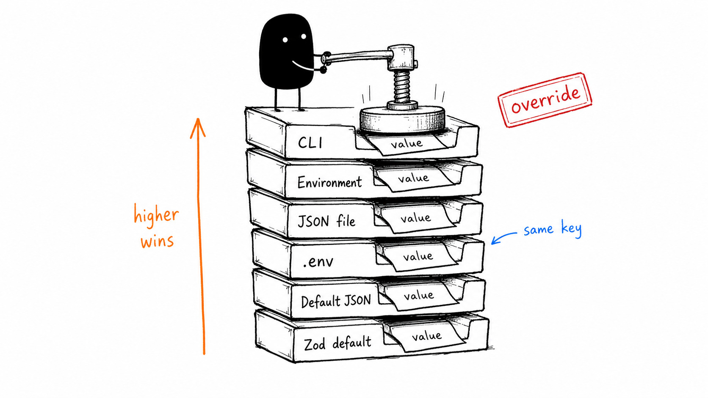

# konfuz

**Configuration management for NPM applications made simple** ⚙️

A zero-boilerplate configuration library that reads from JSON config files, `.env` files, environment variables, and CLI arguments with full type safety using Zod schemas.

konfuz can be customized in different ways. At its simplest, you define a plain object with basic parameters and get environment variable and CLI argument parsing out of the box. For more advanced use cases, you can use `customConfigElement()` to fully tailor environment variable names, CLI flags, short aliases, descriptions, and even mark fields as secrets.

## ✨ Features

- **Multi-source configuration** - Merge values from opt-in JSON files, `.env` files, environment variables, and CLI arguments
- **Priority order** - CLI arguments override environment variables, explicit JSON files, `.env` files, default JSON files, and Zod defaults
- **Type-safe** - Define your config with Zod schemas and get automatic type inference
- **Smart CLI generation** - Automatically generates short (`-p`) and long (`--port`) CLI flags from your schema
- **Custom names** - Customize environment variable names, CLI flags, and CLI short names per field
- **Secret masking** - Mark sensitive fields to redact their values in error messages
- **Node.js focused** - Built for server-side Node.js applications

## 📦 Installation

```bash
npm install konfuz zod
# or
pnpm add konfuz zod
```

> **Note:** `zod` is a peer dependency. You need to install it separately.

## 🚀 Quick Start

```typescript
import { configure } from 'konfuz';
import { z } from 'zod';

const config = configure({
  port: z.number().default(3000),
  host: z.string().default('localhost'),
  verbose: z.boolean(),
});

console.log(`Server running on ${config.host}:${config.port}`);
```

## 📖 Usage

### Basic Configuration

Define your configuration schema using Zod. The library automatically converts your schema keys to `UPPER_SNAKE_CASE` for environment variables and `kebab-case` for CLI flags:

```typescript
const config = configure({
  port: z.number().default(3000),
  host: z.string().default('localhost'),
  enableCache: z.boolean().default(false),
});
```

### Simple Type Syntax

For simple fields, you can use `'string'`, `'number'`, or `'boolean'` instead of a full Zod schema:

```typescript
const config = configure({
  port: 'number',
  host: 'string',
  verbose: 'boolean',
});
```

### Environment Variables

| Schema Key     | Environment Variable |
| -------------- | -------------------- |
| `port`         | `PORT`               |
| `databaseHost` | `DATABASE_HOST`      |
| `enableCache`  | `ENABLE_CACHE`       |

### CLI Arguments

CLI arguments are automatically generated from your schema:

| Schema Key     | Long Flag         | Short Flag |
| -------------- | ----------------- | ---------- |
| `port`         | `--port`          | `-p`       |
| `databaseHost` | `--database-host` | `-d`       |
| `enableCache`  | `--enable-cache`  | `-e`       |

### Priority Order

Values are merged in this order (highest priority wins):

1. **CLI arguments** (highest)
2. **Environment variables**
3. **Explicit JSON file** passed with `--config-file`
4. **`.env` file**
5. **Default JSON file** configured with `options.configFile`
6. **Default values** (from Zod `.default()`)



```bash
# CLI takes precedence over env vars
PORT=3000 node app.js --port 8080  # port will be 8080
```

### Custom Configuration

Use `customConfigElement()` to customize how a field is configured:

```typescript
import { configure, customConfigElement } from 'konfuz';
import { z } from 'zod';

const config = configure({
  // Custom environment variable name
  port: customConfigElement({ type: z.number(), envName: 'SERVER_PORT' }),

  // Custom CLI flag name
  host: customConfigElement({ type: z.string(), cmdName: '--server-host' }),

  // Custom short flag
  verbose: customConfigElement({ type: z.boolean(), cmdNameShort: 'v' }),

  // CLI description for --help output
  debug: customConfigElement({
    type: z.boolean(),
    cmdDescription: 'Enable debug mode',
  }),

  // Custom JSON config lookup path
  serverPort: customConfigElement({
    type: z.number(),
    configPath: '.server.port',
  }),

  // Mark as secret (value redacted in error messages)
  apiKey: customConfigElement({
    type: z.string(),
    envName: 'API_SECRET',
    secret: true,
  }),

  // All options combined
  databaseUrl: customConfigElement({
    type: z.string(),
    envName: 'DATABASE_URL',
    cmdName: '--database-url',
    cmdNameShort: 'd',
    cmdDescription: 'PostgreSQL connection string',
  }),
});
```

**`customConfigElement()` options:**

| Option           | Type                    | Description                                               |
| ---------------- | ----------------------- | --------------------------------------------------------- |
| `type`           | `ZodType \| SimpleType` | Zod schema or simple type ('string', 'number', 'boolean') |
| `envName`        | `string`                | Override the default `UPPER_SNAKE_CASE` env var name      |
| `cmdName`        | `string`                | Override the default `kebab-case` CLI flag (without `--`) |
| `cmdNameShort`   | `string`                | Override the auto-generated CLI short flag                |
| `cmdDescription` | `string`                | Description shown in `--help` output                      |
| `configPath`     | `string`                | Dot-notation lookup path for JSON config files            |
| `secret`         | `boolean`               | Mark field as sensitive to redact in errors               |

### JSON Config Files

JSON config files are opt-in through `options.configFile`:

```typescript
// Enable JSON support with no default file.
// A file is loaded only when the user passes --config-file.
const config = configure(schema, { configFile: true });

// Configure a low-priority default JSON file.
const config = configure(schema, { configFile: 'konfuz.json' });

// Equivalent explicit form.
const config = configure(schema, {
  configFile: { defaultPath: 'konfuz.json' },
});
```

Users can pass an explicit JSON config file with either CLI form:

```bash
node app.js --config-file local.config
node app.js --config-file=local.config
```

Default JSON files are silently ignored when missing. Explicit `--config-file` paths must exist. If both a default JSON file and `--config-file` are configured, the explicit file replaces default JSON discovery rather than layering on top of it. Paths are resolved relative to `process.cwd()` and do not need to end in `.json`; contents are always parsed as JSON.

When JSON config support is enabled, `--config-file` is reserved for the JSON file path. If a field would generate or customize its CLI flag to `--config-file`, set a different `cmdName` with `customConfigElement()`.

JSON values are passed to Zod as native JSON values, without `.env`-style string coercion. For example, `{ "port": 3000 }` is valid for `z.number()`, while `{ "port": "3000" }` is only valid if the schema accepts a string or performs its own coercion. JSON `null` is treated as present and is passed to Zod as `null`.

Unknown JSON keys are ignored. By default, each field reads its original `configure()` key from the JSON root. Use `configPath` to customize a field's JSON lookup:

```typescript
const config = configure(
  {
    port: customConfigElement({
      type: z.number(),
      configPath: '.server.port',
    }),
    host: customConfigElement({
      type: z.string(),
      configPath: '.server.',
    }),
  },
  { configFile: 'konfuz.json' }
);
```

`configPath` is a small jq-inspired dot notation for JSON object lookup. It is not JSONPath, jq, Go templates, or an expression language. It only splits on dots, and every non-dot segment is treated as an exact JSON object key.

| `configPath`     | Lookup behavior                       |
| ---------------- | ------------------------------------- |
| not set          | `port` reads root key `port`          |
| `'.'`            | `port` reads root key `port`          |
| `'.otherName'`   | `port` reads root key `otherName`     |
| `'.server.'`     | `port` reads nested key `server.port` |
| `'.server.port'` | `port` reads nested key `server.port` |
| `'.server[0]'`   | Reads literal root key `server[0]`    |
| `'.path/to/key'` | Reads literal root key `path/to/key`  |
| `'.server port'` | Reads literal root key `server port`  |

Every `configPath` must start with `.`. Empty middle segments such as `.server..port` are invalid. A final empty segment is allowed only as trailing-dot shorthand, such as `.server.`. Brackets do not mean array access, slashes do not have special meaning, and keys containing dots are not addressable in this version.

### Custom .env Path

By default, the library looks for `.env` in the current directory. You can specify a custom path or multiple files:

```typescript
// Single file
const config = configure(schema, { envPath: '/path/to/config.env' });

// Multiple files (later files override earlier ones)
const config = configure(schema, {
  envPath: ['/path/to/.env', '/path/to/.env.local'],
});
```

### CLI Arguments Array

You can pass a custom CLI arguments array instead of using `process.argv`:

```typescript
const config = configure(schema, {
  argv: ['--port', '8080', '--verbose'],
});
```

### Viewing Configuration Sources

The `printConfiguredSources()` function prints a table showing where each configuration value came from:

```typescript
import { configure, printConfiguredSources } from 'konfuz';

const config = configure(
  {
    port: z.number().default(3000),
    host: z.string().default('localhost'),
  },
  {
    configFile: 'konfuz.json',
    argv: ['--port', '3000'],
  }
);

printConfiguredSources(config);
```

Output:

```text
[konfuz] Configuration sources (priority: CLI > Environment > JSON file > .env file > Default JSON > Zod default)

╔══════════════════════╤════════════════════════════════╤════════════════════════════════╤════════════════════════════════╤════════════════════════════════╤════════════════════════════════╤════════════════════════════════╤══════════════════════╗
║ Field                │ Zod default                    │ Default JSON                   │ .env file                      │ JSON file                      │ Environment                    │ CLI                            │ Final value          ║
╟──────────────────────┼────────────────────────────────┼────────────────────────────────┼────────────────────────────────┼────────────────────────────────┼────────────────────────────────┼────────────────────────────────┼──────────────────────╢
║ host                 │ zod=localhost                  │ -                              │ -                              │ -                              │ -                              │ -                              │ localhost            ║
╟──────────────────────┼────────────────────────────────┼────────────────────────────────┼────────────────────────────────┼────────────────────────────────┼────────────────────────────────┼────────────────────────────────┼──────────────────────╢
║ port                 │ zod=3000                       │ -                              │ -                              │ -                              │ -                              │ --port=3000                    │ 3000                 ║
╚══════════════════════╧════════════════════════════════╧════════════════════════════════╧════════════════════════════════╧════════════════════════════════╧════════════════════════════════╧════════════════════════════════╧══════════════════════╝
```

**`ConfigSourceEntry` structure:**

| Property            | Type                                                                              | Description                           |
| ------------------- | --------------------------------------------------------------------------------- | ------------------------------------- |
| `finalSource`       | `'cli' \| 'env' \| 'configFile' \| 'envFile' \| 'defaultConfigFile' \| 'default'` | Where the final value came from       |
| `finalValue`        | `string \| undefined`                                                             | The resolved value as a string        |
| `default`           | `{ name: string, value: string } \| undefined`                                    | Value from Zod `.default()`           |
| `defaultConfigFile` | `{ name: string, value: string } \| undefined`                                    | Value from configured default JSON    |
| `envFile`           | `{ name: string, value: string } \| undefined`                                    | Value from `.env` file                |
| `configFile`        | `{ name: string, value: string } \| undefined`                                    | Value from explicit JSON file         |
| `env`               | `{ name: string, value: string } \| undefined`                                    | Value from environment variable       |
| `cli`               | `{ name: string, value: string } \| undefined`                                    | Value from CLI argument               |
| `secret`            | `boolean \| undefined`                                                            | Whether the field is marked as secret |

### Boolean CLI Flags

Boolean flags have special handling:

```bash
# Flag without value = true
node app.js --verbose          # verbose = true

# Explicit true values
node app.js --verbose 1        # verbose = true
node app.js --verbose true     # verbose = true
node app.js --verbose yes      # verbose = true

# Explicit false values
node app.js --verbose 0        # verbose = false
node app.js --verbose false    # verbose = false
node app.js --verbose no       # verbose = false

# Negation flag
node app.js --no-verbose       # verbose = false
```

### Secret Fields

Mark fields as `secret: true` to redact their values in error messages:

```typescript
const config = configure({
  apiKey: customConfigElement({
    type: z.string(),
    envName: 'API_KEY',
    secret: true,
  }),
});
```

If validation fails or a required secret is missing, the error message will show `***` instead of the actual value.

## 💡 Example Application

```typescript
import { configure, customConfigElement, printConfiguredSources } from 'konfuz';
import { z } from 'zod';

const config = configure({
  port: z.number().default(3000),
  host: z.string().default('localhost'),
  databaseUrl: customConfigElement({
    type: z.string(),
    envName: 'DATABASE_URL',
  }),
  debug: customConfigElement({
    type: z.boolean(),
    cmdNameShort: 'd',
    cmdDescription: 'Enable debug mode',
  }),
});

// Print configuration sources table
printConfiguredSources(config);

// Start your application
console.log(`Starting server on ${config.host}:${config.port}`);
if (config.debug) console.log('Debug mode enabled');
```

Run it:

```bash
# Using defaults
node app.js

# Override with environment variables
DATABASE_URL=postgres://localhost node app.js

# Override with CLI arguments
node app.js --port 8080 --debug
```

## 📄 API Reference

### `configure<T extends ConfigInput>(config: T, options?: ConfigureOptions): InferConfig<T> & { __$sources__: Record<string, ConfigSourceEntry> }`

Main function to configure and parse application configuration.

**Parameters:**

- `config`: Plain object with Zod schemas, simple types ('string', 'number', 'boolean'), or `customConfigElement()` calls
- `options.envPath`: Optional path to `.env` file (string or array for multiple files)
- `options.argv`: Optional CLI arguments array (defaults to `process.argv`)
- `options.configFile`: Optional JSON config support (`true`, `false`, a default path string, or `{ defaultPath: string }`)

**Returns:** The parsed configuration object with type inference and a `__$sources__` property for source tracking.

### `customConfigElement(options: FieldConfigOptions): FieldConfig`

Creates a configuration field with custom options.

**Options:**

```typescript
interface FieldConfigOptions<T extends ConfigFieldType = ConfigFieldType> {
  type: T;
  envName?: string;
  cmdName?: string;
  cmdNameShort?: string;
  cmdDescription?: string;
  configPath?: string;
  secret?: boolean;
}
```

### `printConfiguredSources(configResult: object): void`

Prints a formatted table showing configuration sources for each field.

### `toEnvName(key: string): string`

Converts a camelCase key to UPPER_SNAKE_CASE (e.g., `databaseHost` → `DATABASE_HOST`).

### `toCliName(key: string): string`

Converts a camelCase key to kebab-case (e.g., `databaseHost` → `database-host`).

## 📋 Requirements

- Node.js 18+ (for ESM support)
- Zod 3.x

## 📄 License

ISC
